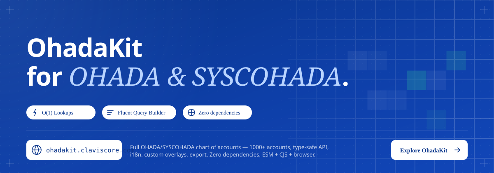

<div align="center">




<h1>OhadaKit</h1>

<p><strong>TypeScript SDK for the OHADA/SYSCOHADA chart of accounts</strong><br/>
O(1) lookups · fluent query builder · custom accounts · i18n · export · zero dependencies</p>

[](https://www.npmjs.com/package/ohadakit)
[](https://www.npmjs.com/package/ohadakit)
[](https://opensource.org/licenses/MIT)
[](https://www.typescriptlang.org/)
[](https://nodejs.org/)

</div>

---

OhadaKit is a production-ready SDK for working with the **OHADA/SYSCOHADA accounting plan** — the standardised chart of accounts used across 17 West and Central African states. It ships the full 1 000+ account tree out of the box and exposes a composable, type-safe API for lookups, querying, custom extensions, multilingual names, and data export.

Live demo: https://ohadakit.claviscore.com

**It manages the chart of accounts.** Journal entries, balances, and financial statements belong in your application.

---

## Table of Contents

- [Table of Contents](#table-of-contents)
- [Features](#features)
- [Installation](#installation)
- [Quick Start](#quick-start)
- [Core API](#core-api)
  - [Account Access](#account-access)
  - [Query Builder](#query-builder)
  - [Account Relationships](#account-relationships)
  - [Internationalization](#internationalization)
  - [Custom Accounts](#custom-accounts)
  - [AccountBook — unified facade](#accountbook--unified-facade)
    - [Snapshot \& restore](#snapshot--restore)
    - [`AccountBook` vs `LedgerEngine`](#accountbook-vs-ledgerengine)
  - [Notes \& Storage](#notes--storage)
  - [Export](#export)
  - [Validation](#validation)
- [Integrating with an Accounting App](#integrating-with-an-accounting-app)
  - [Responsibility boundary](#responsibility-boundary)
- [OHADA Chart Structure](#ohada-chart-structure)
- [Environment Support](#environment-support)
- [Contributing](#contributing)
- [License](#license)

---

## Features

| | |
|---|---|
| **Complete chart** | All 1 000+ official OHADA accounts across 9 classes |
| **O(1) lookups** | Map-based indexes; Trie for fast prefix search |
| **Fluent query builder** | Filter by class, level, parent, name, regex, or custom predicate |
| **Fuzzy search** | Typo-tolerant name search with configurable threshold |
| **Account tree** | Parent, children, ancestors, siblings, path — lazily computed |
| **i18n** | French, English, Portuguese, Spanish with graceful fallback |
| **Custom accounts** | Non-destructive overlay for sub-accounts and label overrides |
| **Pluggable storage** | Notes on any account; memory and `localStorage` adapters included |
| **Snapshot / restore** | Serialisable chart state for database persistence |
| **Export** | JSON (flat or hierarchical) and CSV |
| **Type-safe** | Branded types, `Result<T, E>` error handling, full generics |
| **Zero dependencies** | No runtime dependencies |

---

## Installation

```bash
# npm
npm install ohadakit

# yarn
yarn add ohadakit

# pnpm
pnpm add ohadakit
```

---

## Quick Start

```typescript
import { LedgerEngine } from 'ohadakit';

const ledger = new LedgerEngine();

// Safe lookup — returns a Result<Account>
const result = ledger.get('4111');
if (result.ok) {
  console.log(result.data.name);        // "Clients"
  console.log(result.data.pathString);  // "41 > 411 > 4111"
}

// Convenience accessors
const account  = ledger.getOrNull('4111');   // Account | null
const account2 = ledger.getOrThrow('4111');  // Account  (throws on miss)

// Fluent query builder
const staffExpenses = ledger
  .query()
  .inClass('6')
  .atLevel(3)
  .nameContains('personnel')
  .sortBy('code', 'asc')
  .execute();  // Account[]
```

---

## Core API

### Account Access

```typescript
// Safe — never throws
ledger.get('4111')        // Result<Account>
ledger.getOrNull('4111')  // Account | null

// Eager — throws AccountNotFoundError or InvalidAccountCodeFormatError
ledger.getOrThrow('4111') // Account

// Registry helpers
ledger.registry.has('4111')             // boolean
ledger.registry.getByClass('4')         // Account[]
ledger.registry.getByLevel(3)           // Account[]
ledger.registry.searchByPrefix('41')    // Account[]  (Trie-based)
```

### Query Builder

```typescript
ledger
  .query()
  .inClass(['4', '5'])        // one or more classes
  .atLevel([3, 4])            // one or more levels
  .withParent('41')           // direct children only
  .nameContains('client')     // case-insensitive substring
  .codeMatches(/^6[0-3]/)     // regex on code
  .where(a => a.isLeaf)       // arbitrary predicate
  .sortBy('code', 'asc')      // 'code' | 'name' | 'level'
  .offset(0).limit(25)        // pagination
  .execute();                 // → Account[]

// Aggregation shortcuts
ledger.query().inClass('4').count();   // number
ledger.query().inClass('4').first();   // Account | null
ledger.query().inClass('4').exists();  // boolean

// Fuzzy / typo-tolerant search
ledger
  .query()
  .search('cliens', { fuzzy: true, threshold: 0.6 })
  .execute();
```

### Account Relationships

Relationship properties are lazily computed and cached on first access.

```typescript
const account = ledger.getOrThrow('4111');

account.parent      // Account | null
account.children    // Account[]
account.ancestors   // Account[]  (nearest-first)
account.siblings    // Account[]
account.path        // Account[]  (root → self)
account.pathString  // "41 > 411 > 4111"
account.isLeaf      // boolean
account.isRoot      // boolean
account.depth       // number (1-based)

account.isDescendantOf('4')      // true
account.isAncestorOf('41111')    // true (if account exists)
account.getDescendants()         // Account[]  (all levels)
account.getDescendantsAtLevel(4) // Account[]  (specific level only)
```

### Internationalization

Supports four OHADA locales. Names fall back to French when a translation is missing.

```typescript
const ledger = new LedgerEngine({ locale: 'en' });

ledger.setLocale('pt');
ledger.getLocale();             // 'pt'
ledger.getAvailableLocales();   // ['fr', 'en', 'pt', 'es']

// Localised name with automatic fallback
ledger.getLocalizedName('4111');  // English name, or French if not translated

// Low-level TranslationService
ledger.i18n.getAccountName('10', 'Capital');
ledger.i18n.hasTranslation('10');
```

### Custom Accounts

Extend the immutable OHADA tree without modifying it. Custom accounts and label overrides live in an isolated overlay.

**Rules**
- 2-character main accounts (`10`, `11`, …) cannot be created or renamed.
- Custom accounts must be ≥ 3 characters and start with their parent's code.
- Any 3+-character account (official or custom) can have its label overridden.

```typescript
import { CustomAccountManager, MemoryStorage } from 'ohadakit';

const manager = new CustomAccountManager({ storage: new MemoryStorage() });
await manager.initialize();

// Create a custom sub-account
await manager.createAccount({
  code: '411-VIP',
  name: 'Clients VIP',
  parentCode: '411',
});

// Override an official account label
await manager.updateLabel('4111', 'Clients — Particuliers');

// Query the merged chart
manager.getByCode('411-VIP');    // Account
manager.getAll();                // official + custom
manager.getCustomAccounts();     // custom only
```

### AccountBook — unified facade

`AccountBook` combines every OhadaKit feature behind a single async-initialised object. Start here for any real application.

```typescript
import { AccountBook, MemoryStorage } from 'ohadakit';

const book = new AccountBook({ storage: new MemoryStorage() });
await book.initialize();

// Lookup (official + custom, overrides applied)
const account = book.getAccountOrNull('411');

// Mutate
await book.createAccount({ code: '411-VIP', name: 'Clients VIP', parentCode: '411' });
await book.updateLabel('4111', 'Clients — Particuliers');
await book.setNote('411-VIP', 'High-value clients segment');

// Export the merged chart
const json = book.exportToJSON({ pretty: true });
const csv  = book.exportToCSV();

// i18n
book.setLocale('en');
book.getLocalizedName('10');

// Aggregate stats
const stats = await book.getStats();
// → { total, byClass, byLevel, customAccountCount, labelOverrideCount, noteCount }
```

#### Snapshot & restore

Persist the complete chart state — custom accounts, overrides, and notes — as a plain JSON object that can be stored anywhere.

```typescript
// Capture
const snapshot = await book.snapshot();
// { version, timestamp, locale, customAccounts, labelOverrides, notes }

await db.put('chart-state', JSON.stringify(snapshot));

// Restore into a fresh book
const result = await book.restore(JSON.parse(savedJson));
if (!result.ok) {
  console.error('Restore failed:', result.error.message);
}
```

#### `AccountBook` vs `LedgerEngine`

| Need | Use |
|------|-----|
| Quick lookups on the official chart | `LedgerEngine` |
| Custom accounts, label overrides, notes | `AccountBook` |
| Snapshot / restore of chart state | `AccountBook` |
| Minimal setup with no persistence wiring | `LedgerEngine` |

### Notes & Storage

Attach free-text notes to any account code. The storage backend is swappable.

```typescript
import { LedgerEngine, LocalStorageAdapter } from 'ohadakit';

// Default: in-memory (no persistence)
const ledger = new LedgerEngine();

// Browser: localStorage with a namespaced prefix
const ledger = new LedgerEngine({
  storage: new LocalStorageAdapter('myapp:'),
});

await ledger.setNote('5121', 'Mobile Money Orange');
await ledger.getNote('5121');    // 'Mobile Money Orange'
await ledger.hasNote('5121');    // true
await ledger.deleteNote('5121');
await ledger.getAllNotes();      // Map<string, string>
```

**Custom adapter** — implement the `StorageAdapter` interface to integrate any backend (Redis, IndexedDB, a REST API, etc.).

### Export

```typescript
// JSON
ledger.exportToJSON({ structure: 'flat', pretty: true });
ledger.exportToJSON({ structure: 'hierarchical' });

// CSV
ledger.exportToCSV({ columns: ['code', 'name', 'level'] });
ledger.exportToCSV({ delimiter: ';', includeHeader: true });

// Scoped to a single class
ledger.exportClass('4', 'json', { structure: 'flat' });
ledger.exportClass('4', 'csv',  { columns: ['code', 'name'] });
```

### Validation

```typescript
import { validateAccountCodeFormat, AccountNotFoundError } from 'ohadakit';

// Format check (no registry lookup required)
const fmt = validateAccountCodeFormat('4111');  // Result<string>

// Typed error handling via Result
const result = ledger.get('9999');
if (!result.ok && result.error instanceof AccountNotFoundError) {
  console.error(result.error.message);
}

// Batch validation
const { valid, invalid } = ledger.validateBatch(['4111', '5121', '9999']);
// valid   → [{ code, account }, …]
// invalid → [{ code, error }, …]
```

---

## Integrating with an Accounting App

OhadaKit manages the **chart of accounts** only. Journal entries, balances, and financial statements are your application's responsibility — they link to OhadaKit via account codes used as foreign keys.

```
┌────────────────────────┐       ┌────────────────────────┐
│      Your App          │       │      OhadaKit          │
│                        │       │                        │
│  Journal entries  ─────┼─ FK ──▶  AccountBook           │
│  Balances         ─────┼─ FK ──▶    ├─ Official chart   │
│  Trial balance    ─────┼─ FK ──▶    ├─ Custom accounts  │
│  Financial stmts       │       │    ├─ Label overrides  │
│                        │       │    ├─ Notes            │
│  Your DB / API         │       │    └─ i18n + Export    │
└────────────────────────┘       └────────────────────────┘
```

```typescript
import { AccountBook, MemoryStorage } from 'ohadakit';

const book = new AccountBook({ storage: new MemoryStorage() });
await book.initialize();

// Validate codes before persisting journal entries
function createEntry(debitCode: string, creditCode: string, amount: number) {
  if (!book.has(debitCode))  throw new Error(`Unknown account: ${debitCode}`);
  if (!book.has(creditCode)) throw new Error(`Unknown account: ${creditCode}`);
  return { debitCode, creditCode, amount, date: new Date() };
}

// Resolve display names
function accountLabel(code: string): string {
  return book.getAccountOrNull(code)?.name ?? `Unknown (${code})`;
}

// Persist chart state alongside your application data
async function saveState(db: Database) {
  const snapshot = await book.snapshot();
  await db.put('ohadakit:chart-state', JSON.stringify(snapshot));
}
```

### Responsibility boundary

| Concern | Owner |
|---------|-------|
| Official chart of accounts (1 000+ entries) | OhadaKit |
| Custom sub-accounts & label overrides | OhadaKit — `AccountBook` |
| Account notes | OhadaKit — `AccountBook` |
| Name translations (fr / en / pt / es) | OhadaKit |
| Journal entries & postings | Your app |
| Account balances & trial balance | Your app |
| Financial statements | Your app |
| Authentication & authorisation | Your app |

---

## OHADA Chart Structure

SYSCOHADA uses a **decimal codification** across **9 classes** (codes 1–9). Each class digit is the first digit of the account codes within that class — it is a grouping designator, not a postable account code. Accounts proper are identified by codes of **2 to 4 digits**, constituting 3 levels:

```
[Class — grouping designator, not a postable account]
  e.g. 4  →  Tiers

[Account levels — postable codes, 2 to 4 digits]
  41      Main account    (2 digits)   ← first postable level
  411     Sub-account     (3 digits)
  4111    Detail          (4 digits)   ← base maximum per SYSCOHADA
```

> The base codification of SYSCOHADA is limited to a maximum of four digits for
> divisional accounts (*comptes divisionnaires*). Enterprises may open further
> subdivisions beyond four digits to meet operational needs without altering the
> mandatory normative codes.

| Class | Label | Notes |
|-------|-------|-------|
| 1 | Ressources durables | Mandatory |
| 2 | Actif immobilisé | Mandatory |
| 3 | Stocks | Mandatory |
| 4 | Tiers | Mandatory |
| 5 | Trésorerie | Mandatory |
| 6 | Charges des activités ordinaires | Mandatory |
| 7 | Produits des activités ordinaires | Mandatory |
| 8 | Autres charges et autres produits | Mandatory |
| 9 | Engagements hors bilan et comptabilité analytique de gestion (CAGE) | **Optional** |

> **Class 9** is split into two sub-sections: accounts 90–91 record off-balance-sheet
> commitments (*engagements hors bilan*); accounts 92–99 are reserved for management
> accounting (*comptabilité analytique de gestion*, CAGE). Its use is explicitly
> optional under the SYSCOHADA Uniform Act.

---

## Environment Support

| Environment | Support |
|-------------|---------|
| Node.js ≥ 16 | ✅ ESM + CJS |
| Modern browsers | ✅ UMD + IIFE bundles via `ohadakit/browser` |
| TypeScript | ✅ Full type declarations included |
| Bun / Deno | ✅ ESM entry point |

---

## Contributing

Contributions are welcome. Please open an issue first to discuss significant changes.

```bash
# Clone and install
git clone https://github.com/Dahkenangnon/ohadakit.git
cd ohadakit
npm install

# Run tests
npm test

# Type-check
npm run type-check

# Build
npm run build
```

All pull requests must pass `npm run typecheck && npm test` before review.

---

## License

MIT © [Justin Dah-kenangnon](https://github.com/Dahkenangnon)

---

<div align="center">

[GitHub](https://github.com/Dahkenangnon/ohadakit) · [npm](https://www.npmjs.com/package/ohadakit) · [Issues](https://github.com/Dahkenangnon/ohadakit/issues) · [dah.kenangnon@gmail.com](mailto:dah.kenangnon@gmail.com)

</div>